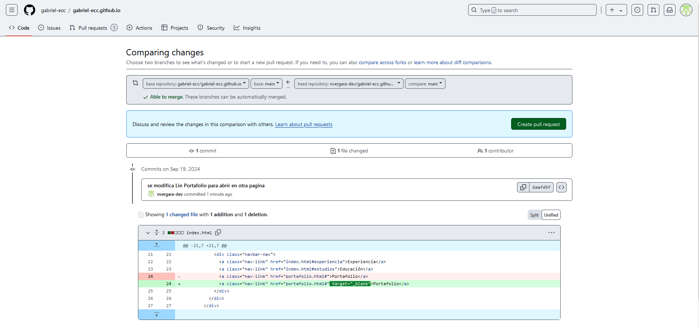
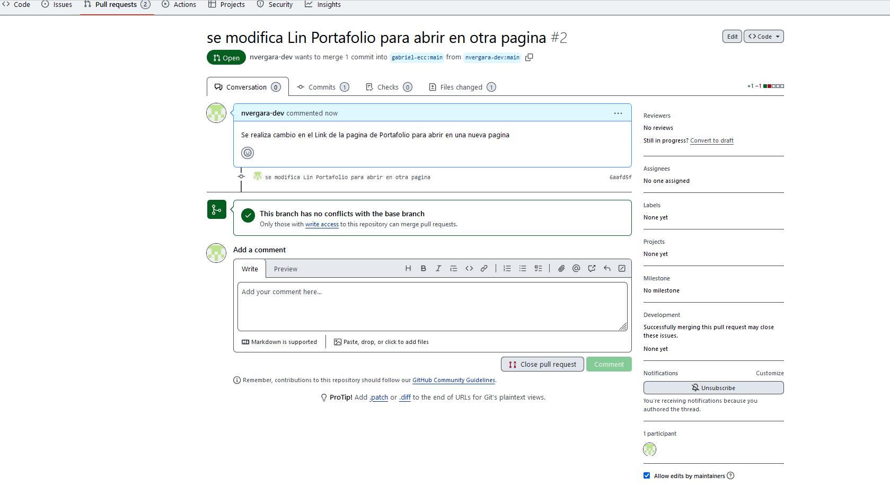
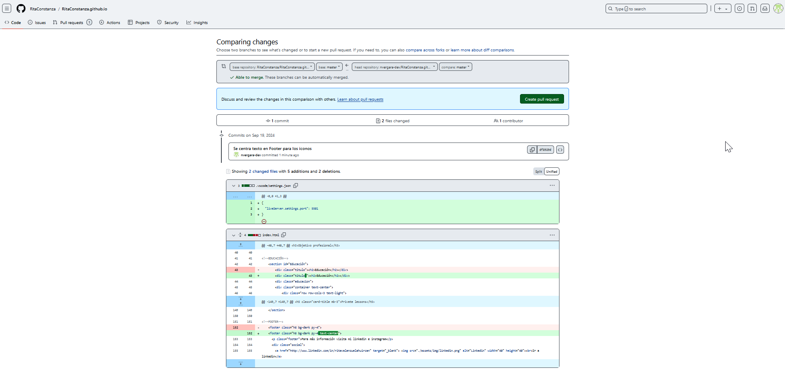
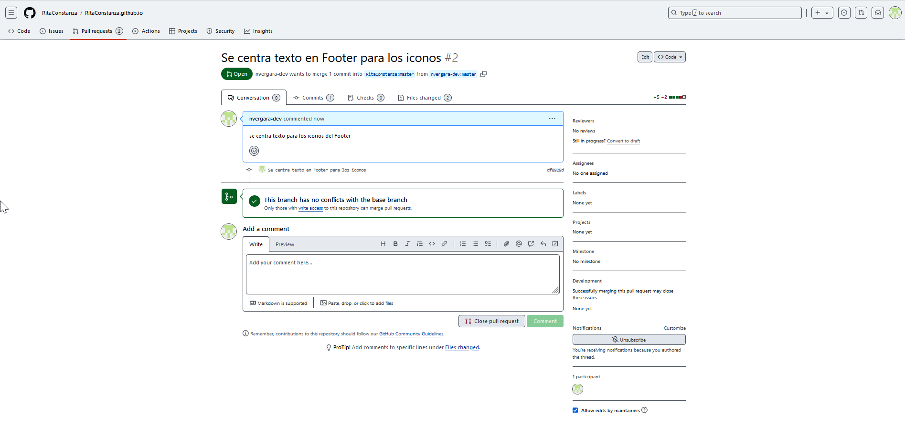

# nvergara-dev.github.io
Autor : Nelson Vergara
Se Toma plantilla de la siguiente manera :

Template Name: iPortfolio
Template URL: https://bootstrapmade.com/iportfolio-bootstrap-portfolio-websites-template/
Author: BootstrapMade.com
License: https://bootstrapmade.com/license/

Se realizan modificaciones estructurales a la pagina , se cambian estilos a nivel de Boostrap, se agrega portafolio dentro de la misma pagina , se agregan link de RRSS y de los GitHub Page, se agregan y cambian imagenes y otros cambios como margenes y dimensiones, entre otros cambios.

GitHub Page :
https://nvergara-dev.github.io/

Se realizan los siguientes Fork.

Fork1:
https://github.com/nvergara-dev/gabriel-ecc.github.io

Commit1:

Se genera Pull Requests:

Fork2:
https://github.com/nvergara-dev/RitaConstanza.github.io

Commit2:

Se genera Pull Requests:
